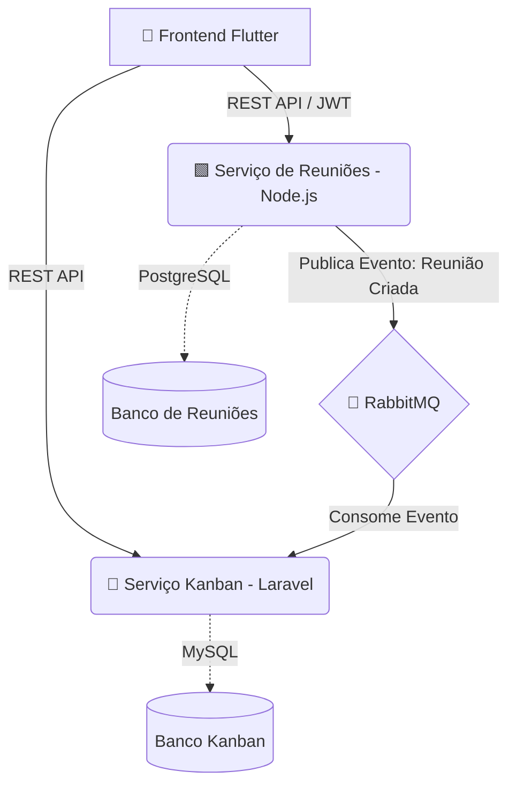

# 📋 MicroSaaS To-Do

Bem-vindo ao **MicroSaaS To-Do**, uma aplicação moderna de gerenciamento de tarefas no estilo Kanban com agendamento de reuniões. O projeto foi projetado utilizando uma **Arquitetura de Microsserviços** e comunicação baseada em eventos (Event-Driven Architecture).

---

## 🏗️ Arquitetura do Sistema

O ecossistema é dividido em três componentes principais que se comunicam de forma assíncrona para garantir alta disponibilidade e escalabilidade.



### 1. Frontend (Flutter)
- Interface de usuário moderna e fluida ("Futuristic Kanban").
- Integração da tela de Kanban e Agendamento de Reuniões.
- Comunicação centralizada via `ApiClient` com os diferentes microsserviços.

### 2. Serviço de Reuniões (Node.js + Prisma)
- Gerencia a criação e o agendamento de reuniões.
- Banco de Dados: **PostgreSQL**.
- Ao criar uma nova reunião, este serviço publica um evento na fila do **RabbitMQ** para que uma tarefa/cartão correspondente seja criada no Kanban automaticamente.

### 3. Serviço Kanban (PHP 8.3 + Laravel 12) *[Contido neste repositório]*
- Gerencia quadros (Boards) e cartões (Cards) do Kanban.
- Banco de Dados: **MySQL 8.0**.
- Atua como um *Consumer*, lendo os eventos do RabbitMQ para transformar automaticamente as novas reuniões em tarefas no Kanban.

---

## 🐘 Serviço Kanban (Repositório Atual)

Este repositório contém o código fonte do **Serviço Kanban**, focado no back-end de gestão das tarefas e no consumo de filas do RabbitMQ.

### 🚀 Tecnologias

| Camada | Tecnologia |
|---|---|
| Backend | PHP 8.3 + Laravel 12 |
| Banco de dados | MySQL 8.0 (produção) / SQLite (testes) |
| Frontend | Tailwind CSS v4 + Vite |
| Containerização | Docker + Docker Compose |
| Servidor web | Nginx (Alpine) |
| Filas | RabbitMQ 3 |
| Documentação | Swagger / L5-Swagger |

### 📦 Estrutura do Projeto

```text
MicroSaas_To_do/
├── php-service/                  # Aplicação Laravel (Microsserviço Kanban)
│   ├── app/
│   │   ├── Http/Controllers/     # Controllers REST API
│   │   ├── Jobs/                 # Processamento de Filas (Ex: ProcessarEventoReuniao)
│   │   ├── Models/               # Modelos Eloquent (Board, Card)
│   │   └── Repositories/         # Repository Pattern (Interface e Implementação Eloquent)
│   ├── routes/
│   ├── docker-config/
│   ├── Dockerfile
│   └── docker-compose.yaml
└── README.md
```

---

## ⚙️ Pré-requisitos Gerais

- **Docker** e **Docker Compose**
- **PHP 8.2+** e **Composer** (para execução local sem Docker)
- **Node.js 18+** e **npm**

---

## 🔧 Instalação e Execução (Com Docker - Recomendado)

**1. Clone o repositório:**
```bash
git clone <url-do-repositorio>
cd MicroSaas_To_do/php-service
```

**2. Configure as variáveis de ambiente:**
```bash
cp .env.example .env
```
*Edite o arquivo `.env` para apontar para o banco MySQL do Docker:*
```env
DB_CONNECTION=mysql
DB_HOST=db
DB_PORT=3306
DB_DATABASE=microsaas
DB_USERNAME=root
DB_PASSWORD=root
```

**3. Suba os containers:**
```bash
docker-compose up -d --build
```

**4. Instale as dependências e configure a aplicação:**
> **Dica para Mac Intel:** Se o Docker não conectar, execute `docker context use colima` antes dos comandos abaixo.

```bash
docker exec -it micro-app composer install
docker exec -it micro-app php artisan key:generate
docker exec -it micro-app php artisan migrate
# Garanta permissões de escrita para o Laravel
docker exec -it micro-app chmod -R 777 storage bootstrap/cache

**5. Acesse os Serviços:**
- Aplicação Laravel: http://localhost:8081
- Documentação Swagger: http://localhost:8081/api/documentation
- RabbitMQ Management: http://localhost:15672 (user: `guest` / pass: `guest`)

---

## 🐰 Mensageria com RabbitMQ (Testando e Consumindo Filas)

O Laravel atua como *Consumer* dos eventos publicados pelo microsserviço Node.js.

**Para iniciar o consumo de mensagens (Worker):**
```bash
# Se estiver usando Docker:
docker exec -it micro-app php artisan queue:work

# Se estiver rodando localmente (sem docker):
cd php-service
php artisan queue:work
```

### Simulando o envio de eventos

Você pode simular o envio de um evento direto pelo painel de administração do RabbitMQ para testar a automação de criação de cards:

1. Acesse o **RabbitMQ Management UI**: [http://localhost:15672](http://localhost:15672).
2. Navegue até a aba **Queues** e clique na fila correspondente (geralmente `default`).
3. Expanda a área **Publish message**.
4. No campo **Payload**, insira o formato JSON esperado pelo job `ProcessarEventoReuniao`:
   ```json
   {
       "title": "Reunião de Alinhamento Estratégico",
       "description": "Discussão das prioridades do trimestre.",
       "date": "15/05/2026 às 10:00"
   }
   ```
5. Clique em **Publish message**.

Ao fazer isso, observe o terminal onde está rodando o `queue:work`. O evento será processado e um novo **Card** será criado e adicionado ao "Board" padrão no seu banco de dados MySQL.

---

## 🏗️ Padrão de Projeto (Repository Pattern)

O serviço Kanban utiliza o **Repository Pattern**, desacoplando a lógica de negócio do acesso direto ao banco de dados via Eloquent.

- **`CardRepositoryInterface`**: Define o contrato e os métodos base (`getAll`, `findById`, `create`, `update`, `delete`).
- **`EloquentCardRepository`**: Implementa a interface utilizando os Models do Eloquent.

Essa abordagem facilita a manutenção, permite a troca da fonte de dados (caso a aplicação mude) sem afetar os controllers, e torna os testes mais confiáveis.

---

## 🧪 Testes

A aplicação utiliza o **PHPUnit** para garantir o funcionamento correto de suas funcionalidades.

```bash
# Executando testes via Docker
docker exec -it micro-app php artisan test

# Executando testes localmente
php artisan test
```
*Observação: Os testes rodam utilizando o SQLite em memória, conforme configurado no `phpunit.xml`, portanto não afetam os dados do ambiente de desenvolvimento.*

---

## 🤝 Contribuindo

1. Crie uma branch a partir da `main`:
   ```bash
   git checkout -b feature/minha-nova-funcionalidade
   ```
2. Faça suas alterações e formate o código utilizando o Laravel Pint:
   ```bash
   ./vendor/bin/pint
   ```
3. Rode os testes para garantir que tudo está funcionando:
   ```bash
   php artisan test
   ```
4. Abra um Pull Request detalhando suas mudanças.
